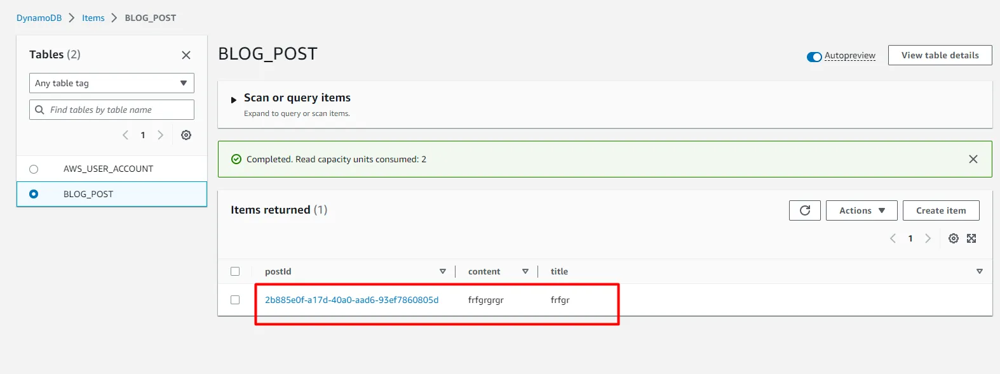

# AWS SAM COGNITO REST API

How to Build a Serverless REST API with AWS-SAM, Cognito, Node.js, TypeScript, and AWS DynamoDB


## Prerequisites

- [SAM CLI](https://docs.aws.amazon.com/serverless-application-model/latest/developerguide/serverless-sam-cli-install-mac.html)
- [NodeJs](https://nodejs.org/en)
- AWS CLI installed and configured
  

## Build and Deploy

Clone the project

```bash
  git clone https://github.com/ChamomileTommy/aws-sam-cognito-restapi-blogposts.git
```

Go to the project directory

```bash
  cd cd aws-sam-cognito-restapi-blogposts/blogposts
```

Install dependencies

```bash
  npm install
```

Back to folder aws-sam-cognito-restapi-blogposts

```bash
  cd ..
```

Build SAM

```bash
  sam build
```

Deploy SAM

```bash
  sam deploy --guided --profile admin
```


Move to folder scripts and Generate Token

```bash
  cd scripts
  ./create-accessToken.sh
```


## Endpoints of API

- POST /blogposts - creates new post with autogenerated UUID as PostID
- GET /blogposts/{uuid} - gets a post by UUID
- PUT /blogposts/{uuid} - updates a post by UUID
- DELETE /blogposts/{uuid} - deletes a post by UUID
- GET /blogposts - gets a list of posts

## Demo and Test

Copy Access Token


Get and copy API Endpoint


Paste Access Token in Authorization of Header


Postman test


DynamoDB confirm



## 🚀 About Me

I'm a full stack developer for 4 years
